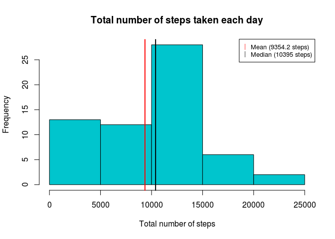
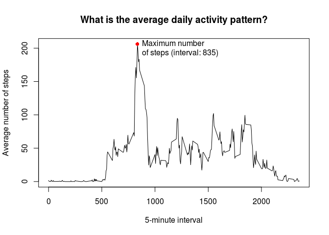

# Reproducible Research: Peer Assessment 1


## Requiring packages


```r
library(dplyr)
```


## Loading and preprocessing the data

Here we unzip, read the activity data and format time to analysis.


```r
activityData <- read.csv(unz("activity.zip", "activity.csv"), sep = ",")
activityData$date <- as.Date(as.character(activityData$date), "%Y-%m-%d")
```


## What is mean total number of steps taken per day?

First we group data by date and sumarise the sum of steps

```r
totalByDay <- group_by(activityData, date) %>% summarize(steps = sum(steps, na.rm = TRUE))
```

Result:

```r
head(totalByDay, 10)
```

```
## # A tibble: 10 x 2
##          date steps
##        <date> <int>
##  1 2012-10-01     0
##  2 2012-10-02   126
##  3 2012-10-03 11352
##  4 2012-10-04 12116
##  5 2012-10-05 13294
##  6 2012-10-06 15420
##  7 2012-10-07 11015
##  8 2012-10-08     0
##  9 2012-10-09 12811
## 10 2012-10-10  9900
```

Now we get the mean and the average

```r
meanSteps <- mean(totalByDay$steps, na.rm = TRUE)
medianSteps <- median(totalByDay$steps, na.rm = TRUE)
```

And add everything in a good informative plot

```r
hist(totalByDay$steps, col = "turquoise3", xlab = "Total number of steps", main = "Total number of steps taken each day")

#Add lines in the mean and median
abline(v=meanSteps, col="red", lwd=2)
abline(v=medianSteps, col="black", lwd=2)

legend(
    "topright", # places a legend at the appropriate place
    c(paste0("Mean (", round(meanSteps,1)," steps)"),
      paste0("Median (", medianSteps," steps)")), # puts text in the legend
    pch = c("|","|"), # gives the legend appropriate symbols
    col=c("red", "black"),# gives the legend lines the correct color
    cex=0.8 # gives the legend box size
) 
```




## What is the average daily activity pattern?

First we need to group the data by interval and summarize the average.

```r
interval <- group_by(activityData, interval) %>%
            summarise(averageSteps = mean(steps, na.rm = TRUE))
```

Result:

```r
head(interval, 10)
```

```
## # A tibble: 10 x 2
##    interval averageSteps
##       <int>        <dbl>
##  1        0    1.7169811
##  2        5    0.3396226
##  3       10    0.1320755
##  4       15    0.1509434
##  5       20    0.0754717
##  6       25    2.0943396
##  7       30    0.5283019
##  8       35    0.8679245
##  9       40    0.0000000
## 10       45    1.4716981
```

Now we can get the interval with the maximum average number of steps.

```r
maxSteps <- interval[interval$averageSteps == max(interval$averageSteps), ]
```

Let's make a time series plot of the 5-minute interval (x-axis) and the average number of steps taken, averaged across all days.

```r
with(interval, plot(interval, averageSteps, type = "l", xlab = "5-minute interval", ylab = "Average number of steps"))
title(main="What is the average daily activity pattern?")

# Finally we can add a point to indicate the interval with the maximum number of steps
legendText <- paste0("\n \nMaximum number \nof steps (interval: ", maxSteps$interval,")")
points(maxSteps$interval, maxSteps$averageSteps, pch = 16, col = "red")
text(maxSteps$interval, maxSteps$averageSteps, labels = legendText, pos = 4)
```



## Imputing missing values


## Are there differences in activity patterns between weekdays and weekends?
