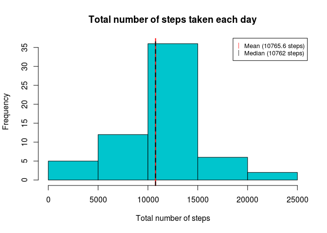
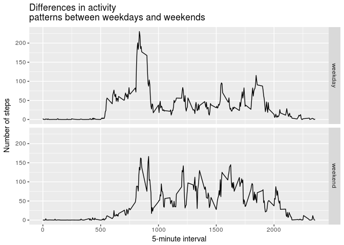

# Reproducible Research: Peer Assessment 1


## Requiring packages


```r
library(dplyr)
```


## Loading and preprocessing the data

Here we unzip, read the activity data and format time to analysis.


```r
activityData <- read.csv(unz("activity.zip", "activity.csv"), sep = ",")
activityData$date <- as.Date(as.character(activityData$date), "%Y-%m-%d")
```


## What is mean total number of steps taken per day?

First we group data by date and sumarise the sum of steps

```r
totalByDay <- group_by(activityData, date) %>% summarize(steps = sum(steps, na.rm = TRUE))
```

Result:

```r
head(totalByDay, 10)
```

```
## # A tibble: 10 x 2
##          date steps
##        <date> <int>
##  1 2012-10-01     0
##  2 2012-10-02   126
##  3 2012-10-03 11352
##  4 2012-10-04 12116
##  5 2012-10-05 13294
##  6 2012-10-06 15420
##  7 2012-10-07 11015
##  8 2012-10-08     0
##  9 2012-10-09 12811
## 10 2012-10-10  9900
```

Now we get the mean and the median

```r
meanSteps <- mean(totalByDay$steps, na.rm = TRUE)
medianSteps <- median(totalByDay$steps, na.rm = TRUE)
```

And add everything in a good informative plot

```r
hist(totalByDay$steps, col = "turquoise3", xlab = "Total number of steps", main = "Total number of steps taken each day")

#Add lines in the mean and median
abline(v=meanSteps, col="red", lwd=2)
abline(v=medianSteps, col="black", lwd=2)

legend(
    "topright", # places a legend at the appropriate place
    c(paste0("Mean (", round(meanSteps,1)," steps)"),
      paste0("Median (", medianSteps," steps)")), # puts text in the legend
    pch = c("|","|"), # gives the legend appropriate symbols
    col=c("red", "black"),# gives the legend lines the correct color
    cex=0.8 # gives the legend box size
) 
```


## What is the average daily activity pattern?

First we need to group the data by interval and summarize the average.

```r
groupInterval <- group_by(activityData, interval) %>%
            summarise(averageSteps = mean(steps, na.rm = TRUE))
```

Result:

```r
head(groupInterval, 10)
```

```
## # A tibble: 10 x 2
##    interval averageSteps
##       <int>        <dbl>
##  1        0    1.7169811
##  2        5    0.3396226
##  3       10    0.1320755
##  4       15    0.1509434
##  5       20    0.0754717
##  6       25    2.0943396
##  7       30    0.5283019
##  8       35    0.8679245
##  9       40    0.0000000
## 10       45    1.4716981
```

Now we can get the interval with the maximum average number of steps.

```r
maxSteps <- groupInterval[groupInterval$averageSteps == max(groupInterval$averageSteps), ]
```

Let's make a time series plot of the 5-minute interval (x-axis) and the average number of steps taken, averaged across all days.

```r
with(groupInterval, plot(interval, averageSteps, type = "l", xlab = "5-minute interval", ylab = "Average number of steps"))
title(main="What is the average daily activity pattern?")

# Finally we can add a point to indicate the interval with the maximum number of steps
legendText <- paste0("\n \nMaximum number \nof steps (interval: ", maxSteps$interval,")")
points(maxSteps$interval, maxSteps$averageSteps, pch = 16, col = "red")
text(maxSteps$interval, maxSteps$averageSteps, labels = legendText, pos = 4)
```


## Imputing missing values

Note that there is some missing values in our data


```r
# Number of lines with missing values
missingValuesCount <- nrow(activityData[is.na(activityData$steps), ])
print(missingValuesCount)
```

```
## [1] 2304
```

Has been there 2304 missing values, it can be changing the result, so let's
fill theses values using the average by interval data used in the previous question.


```r
# Creating a new datset with original data
filledData <- activityData 

# Loop through the rows
for(i in 1:nrow(filledData)){
    # Verify if this row has missing value
    if(is.na(filledData[i, "steps"])){
        # Get row 5-minute interval
        rowInterval <- filledData[i, "interval"]
        
        # Filling in the missing value with the round of the mean value to this interval
        filledData[i, "steps"] <- round(groupInterval[groupInterval$interval == rowInterval, "averageSteps"], 0)
    }
}
```

In our new data set there is no more missing values


```r
# Number of lines with missing values in new data set
nrow(filledData[is.na(filledData$steps), ])
```

```
## [1] 0
```

And we can set the difference in the first rows

```r
# Original data
head(activityData,10)
```

```
##    steps       date interval
## 1     NA 2012-10-01        0
## 2     NA 2012-10-01        5
## 3     NA 2012-10-01       10
## 4     NA 2012-10-01       15
## 5     NA 2012-10-01       20
## 6     NA 2012-10-01       25
## 7     NA 2012-10-01       30
## 8     NA 2012-10-01       35
## 9     NA 2012-10-01       40
## 10    NA 2012-10-01       45
```

```r
# Filled in data
head(filledData,10)
```

```
##    steps       date interval
## 1      2 2012-10-01        0
## 2      0 2012-10-01        5
## 3      0 2012-10-01       10
## 4      0 2012-10-01       15
## 5      0 2012-10-01       20
## 6      2 2012-10-01       25
## 7      1 2012-10-01       30
## 8      1 2012-10-01       35
## 9      0 2012-10-01       40
## 10     1 2012-10-01       45
```

First we group data by date and sumarise the sum of steps

```r
filledTotalByDay <- group_by(filledData, date) %>% summarize(steps = sum(steps, na.rm = TRUE))
```

Result:

```r
head(filledTotalByDay, 10)
```

```
## # A tibble: 10 x 2
##          date steps
##        <date> <dbl>
##  1 2012-10-01 10762
##  2 2012-10-02   126
##  3 2012-10-03 11352
##  4 2012-10-04 12116
##  5 2012-10-05 13294
##  6 2012-10-06 15420
##  7 2012-10-07 11015
##  8 2012-10-08 10762
##  9 2012-10-09 12811
## 10 2012-10-10  9900
```

Now we get the mean and the median

```r
meanSteps <- mean(filledTotalByDay$steps, na.rm = TRUE)
medianSteps <- median(filledTotalByDay$steps, na.rm = TRUE)
```

And add everything in a good informative plot

```r
hist(filledTotalByDay$steps, col = "turquoise3", xlab = "Total number of steps", main = "Total number of steps taken each day")

#Add lines in the mean and median
abline(v=meanSteps, col="red", lwd=2)
abline(v=medianSteps, col="black", lwd=2, lty = 2)

legend(
    "topright", # places a legend at the appropriate place
    c(paste0("Mean (", round(meanSteps,1)," steps)"),
      paste0("Median (", medianSteps," steps)")), # puts text in the legend
    pch = c("|","|"), # gives the legend appropriate symbols
    col=c("red", "black"),# gives the legend lines the correct color
    cex=0.8 # gives the legend box size
) 
```



Without missing values the mean value increased and is closest to median

## Are there differences in activity patterns between weekdays and weekends?

It's a good idea to set locale category to show week days in English

```r
Sys.setlocale("LC_TIME", "C")
```

```
## [1] "C"
```

```r
unique(weekdays(filledData$date))
```

```
## [1] "Monday"    "Tuesday"   "Wednesday" "Thursday"  "Friday"    "Saturday" 
## [7] "Sunday"
```

Now we will create a new factor variable to indicating whether a given date is a weekday or weekend day and group the data by interval and weekday

```r
filledData$weekday <- "weekday"
filledData[weekdays(filledData$date) %in% c("Saturday", "Sunday"), "weekday"] <- "weekend"
filledData$weekday <- as.factor(filledData$weekday)

#Group by interval and weekday and summarize the average
groupIntervalWeekDay <- group_by(filledData, interval, weekday) %>%
    summarise(averageSteps = mean(steps, na.rm = TRUE))

head(groupIntervalWeekDay, 10)
```

```
## # A tibble: 10 x 3
## # Groups:   interval [5]
##    interval weekday averageSteps
##       <int>  <fctr>        <dbl>
##  1        0 weekday   2.28888889
##  2        0 weekend   0.25000000
##  3        5 weekday   0.40000000
##  4        5 weekend   0.00000000
##  5       10 weekday   0.15555556
##  6       10 weekend   0.00000000
##  7       15 weekday   0.17777778
##  8       15 weekend   0.00000000
##  9       20 weekday   0.08888889
## 10       20 weekend   0.00000000
```

We will use the ggplot2 library to make more easy to create panel plots

```r
library(ggplot2)
```


```r
qplot(interval, averageSteps, data = groupIntervalWeekDay,
      facets = weekday ~ ., geom = "line",
      xlab = "5-minute interval", ylab = "Number of steps",
      main = "Differences in activity \npatterns between weekdays and weekends")
```


